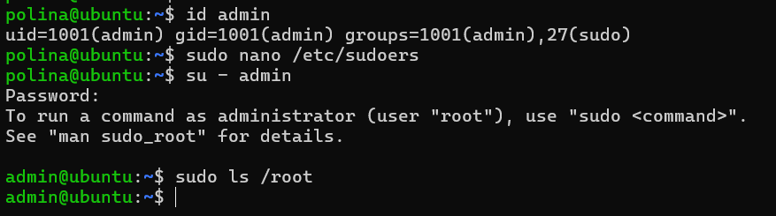
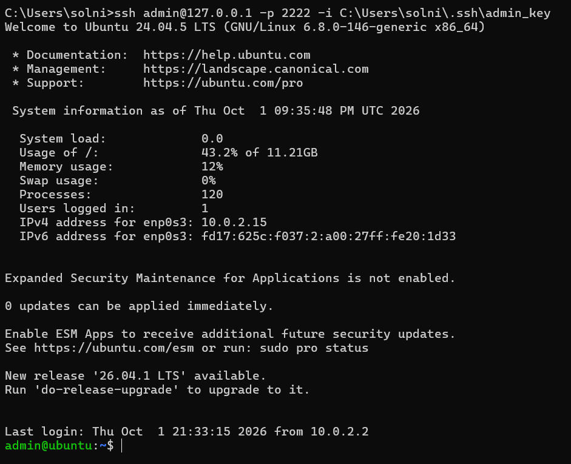
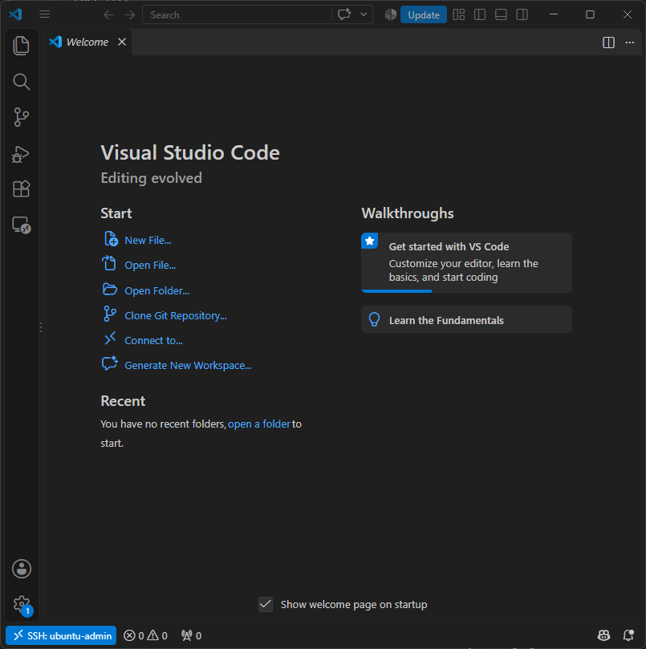

```markdown
# Лабораторная работа №1: Настройка Ubuntu Server и SSH

## Описание
Развёрнута виртуальная машина Ubuntu Server 24.04 LTS в VirtualBox. Выполнена базовая настройка системы, создан пользователь с правами sudo, настроена аутентификация по SSH-ключам и подключение через VS Code Remote-SSH.

## Выполненные задачи

### 1. Установка и настройка Ubuntu Server
- Установлена Ubuntu 24.04.5 LTS в VirtualBox
- Настроена сеть: NAT + проброс порта 2222 → 22
- Установлены пакеты: python3, git, openssh-server

### 2. Создание пользователя и настройка sudo
- Создан пользователь `admin` с домашним каталогом
- Добавлен в группу `sudo`
- Настроено выполнение sudo без пароля (NOPASSWD)

### 3. Настройка SSH по ключу
- Сгенерирован ключ ed25519 на хост-машине (Windows)
- Публичный ключ скопирован на VM
- Настроен вход без пароля

### 4. Подключение через VS Code
- Установлен плагин Remote-SSH
- Настроен конфиг подключения
- Успешное подключение к VM

## Демонстрация результатов

### Скриншот 1: Проверка пользователя и sudo без пароля

*Команда `sudo ls /root` выполнена без запроса пароля*

### Скриншот 2: Вход по SSH-ключу

*Подключение через `ssh admin@127.0.0.1 -p 2222 -i admin_key` без пароля*

### Скриншот 3: Подключение через VS Code Remote-SSH

*Зелёный индикатор "SSH: ubuntu-admin" в левом нижнем углу*

## Конфигурация SSH (хост-машина Windows)

Файл `~/.ssh/config`:

```text
Host ubuntu-admin
    HostName 127.0.0.1
    Port 2222
    User admin
    IdentityFile C:\Users\solni\.ssh\admin_key
    PubkeyAuthentication yes
